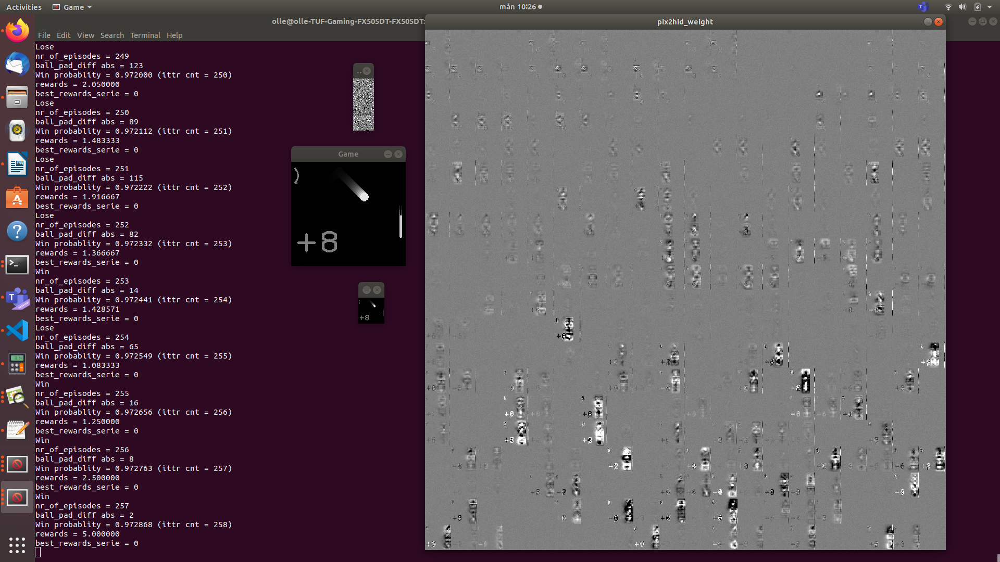
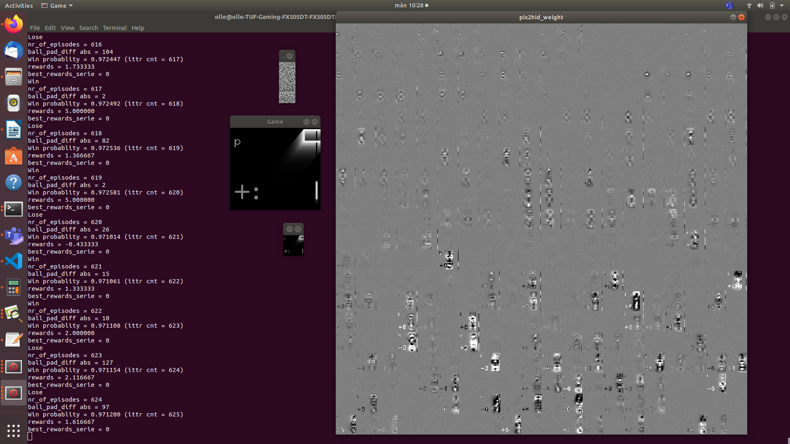

# Reinforcement-machine-learning-policy-gradient-from-pixels-C-OpenCV
Pong game catch circles but avoid rectangles 
first version 
Tested on Linux Ubuntu OpenCV 4.3.0

====== Update 2020-07-17 ============

Note Updated and tested with OpenCV 4.3.0
OpenCV installation process changed
cmake installation change

`/build$ sudo cmake -D OPENCV_GENERATE_PKGCONFIG=ON ..` 

Changed makefile

`OPENCV = pkg-config --cflags --libs opencv4`

Add 

`#include <opencv2/core/types_c.h>`

Remove 

`CV_`

prefix reference 

`CV_FONT_HERSHEY_PLAIN`

in source pinball_game.hpp files.

=====================================

Youtube demo at:
https://www.youtube.com/watch?v=fO5CFOeZen8&t=43s

dependencies: OpenCV
To install OpenCV
first install 
cmake

`$ sudo apt-get update`

`$ wget https://github.com/Kitware/CMake/releases/download/v3.15.2/cmake-3.15.2.tar.gz`

`$ tar -zxvf cmake-3.15.2.tar.gz`

`$ cd cmake-3.15.2`

`$ ./bootstrap`

`$ make`

`$ sudo make install`

`$ cmake --version`

Then Install OpenCV
download:

https://github.com/opencv/opencv

unzip opencv-master.zip

change directory to unziped folder

`$ mkdir build`

`$ cd build`

Oboslete only for OpenCV 3.1

`/build$ sudo cmake ..` 

Update for OpenCV 4.3.0

`/build$ sudo cmake -D OPENCV_GENERATE_PKGCONFIG=ON ..` 

`/build$ sudo make`

`/build$ sudo make install`

Change directory to this repo

unzip then compile this repo

`$ cd Reinforcement-machine-learning-policy-gradient-from-pixels-C-OpenCV-master`

`$ make`

Run

`$ ./exe_main`

Or use cmake CMakeFiles.txt

`$ sudo cmake CMakeLists.txt`

`$ sudo make`

`$ ./pong`

If you want to test my trained weights ~100000 training episodes
combine the splited 6M files pix2hid_weight.parta* with this command

`$ cat pix2hid_weight.parta* > pix2hid_weight.dat.tar.gz` 

then extract the file:
`pix2hid_weight.dat.tar.gz`

start program and enter 
N
Y
Y
on the 3 comming question 
  
(if you get 
Error while opening file pix2hid_weight.dat
you maybee foreget extract the pix2hid_weight.dat.tar.gz)

